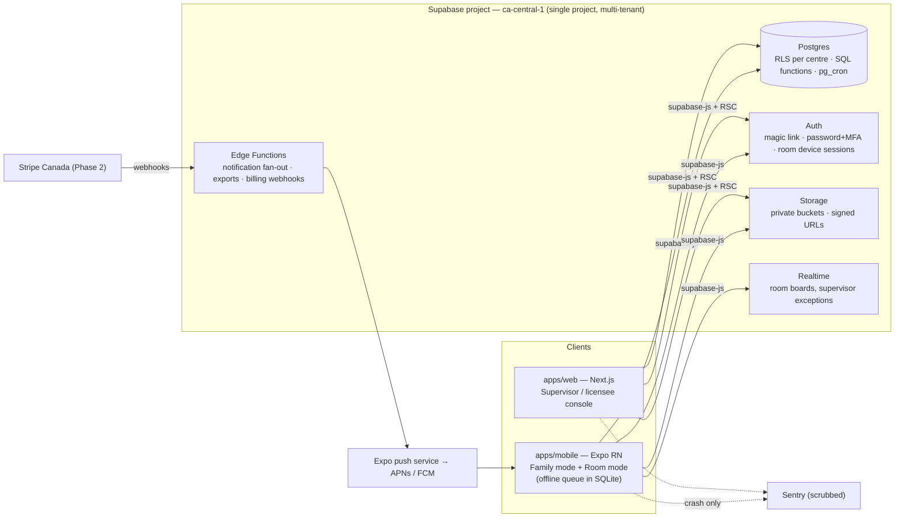

# Tucked — architecture reference

*How the system is put together and why. The canonical build specification is [tucked-build-prompt.md](tucked-build-prompt.md) — this document explains the architecture in more depth, records the reasoning, and adds the low-running-cost engineering rules that every technical decision must pass. Where the two disagree, the build prompt wins; update both.*

---

## 1. Constraints that shape everything

1. **Compliance is the product.** Ontario Reg. 137/15 records must be impossible to lose, always available on premises (including offline), retained 3–6 years, and exportable by regulation section. This pushes logic *into the database* — rules enforced by Postgres constraints and RLS survive client bugs.
2. **Solo founder, second product.** Unifloe is still the day job. Every component must be managed, boring, and require zero ops attention in the steady state. No servers to patch, no clusters, no queues to babysit.
3. **Super low running costs** (standing order). Fixed monthly spend stays near zero until a pilot centre exists, and grows in small, predictable steps after. The full budget and guardrails live in [cost-model.md](cost-model.md); the architectural consequences are woven through this document and marked **[cost]**.
4. **Data stays in Canada.** All data, files and function execution in `ca-central-1`. This is a brand promise, not just a setting.
5. **Real native apps for families and rooms.** The "Now" alert channel must be dependable on iPhones; room tablets need camera, offline storage, long sessions.

## 2. System overview



One Supabase project serves every centre. **Tenancy is rows, not infrastructure** — every table carries `centre_id`, RLS enforces isolation in the database, and pgTAP tests prove it for every role including "wrong centre", "removed household member" and "restricted pickup person". **[cost]** This is the single biggest cost decision: per-tenant projects or servers would multiply the floor cost by the number of centres; per-tenant *rows* cost nothing.

## 3. The monorepo

pnpm workspaces + Turborepo, TypeScript strict everywhere.

```
apps/
  mobile/          Expo (latest SDK), Expo Router. One binary, two modes:
                   Family (household adults) and Room (educators, PIN-locked).
                   Supervisor essentials (alerts, ratios, approvals) also here.
  web/             Next.js App Router. Supervisor & licensee console: settings,
                   records, exports, billing, reports. Plain CSS + custom
                   properties from ui-tokens. No Tailwind, no CSS-in-JS.
packages/
  domain/          Pure TypeScript. Types, Zod schemas, the Ontario rule engine
                   (ratios & reduced-ratio windows, age-group presets, retention
                   clocks, notification routing, daily-record drafting), province
                   & room presets, i18n strings (en-CA live, fr-CA scaffolded).
                   No React, no Supabase imports. The most-tested code in the repo.
  ui-tokens/       Design tokens (see design-language.md §11) for RN StyleSheet
                   and CSS variables.
supabase/          Migrations, RLS policies, SQL functions, Edge Functions,
                   pg_cron schedules, seed scripts, pgTAP tests.
docs/              plans/phase-N.md, decisions.md, compliance-map.md.
```

**Why `packages/domain` is pure:** the same ratio calculation must run on the room tablet (offline), in an Edge Function (fan-out), and in a pgTAP fixture check. Purity makes it portable and makes the ≥ 90% branch-coverage gate cheap to hold. Every rule test is named for its regulation section (`s72_attendance_requires_actual_times`).

## 4. Stack decisions (decided — recorded so they aren't relitigated)

| Decision | Choice | Rejected | Why |
|---|---|---|---|
| Mobile | **Expo (React Native)** | Capacitor, PWA, native Swift/Kotlin | Dependable push on iOS; real store listing; EAS Build in the cloud (no Mac); EAS Update ships fixes without review; React/TS skills carry over from Unifloe. Capacitor = webview feel + Mac/CI needed + thin-wrapper rejection risk. |
| Backend | **Supabase, `ca-central-1`** | MongoDB Atlas, Firebase, self-hosted Postgres | Compliance data is relational (child × room × day × record type). RLS puts tenancy in the DB. Auth+Storage+Realtime+Functions built in — weeks of plumbing avoided. Firebase can't promise Canada for every service; Mongo can't do RLS. **[cost]** one flat bill covers db, auth, files, functions, cron. |
| Web console | **Next.js App Router** | Remix, SPA | Server components keep the console light; exports/PDF render server-side. |
| Styling | **Tokens + StyleSheet / plain CSS** | Tailwind, NativeWind, CSS-in-JS | One token file drives both platforms; no runtime styling cost; no framework churn. |
| Payments (P2) | **Stripe Canada** — cards + pre-authorised debit (ACSS/PAD); Interac e-Transfer as record-and-reconcile | Moneris, custom | PAD is the fee-free-for-parents rail; e-Transfer has no receiving API anywhere, so reconciliation against per-invoice reference codes is the honest design. Parents never pay fees. |
| Push | **Expo push service** | raw APNs/FCM, OneSignal | Free, covers both platforms, no extra vendor. **[cost]** |
| Observability | **Sentry free tier + structured logs + `/health`** | Datadog etc. | Enough for one operator. PII scrubbed: no request bodies, no child names. **[cost]** |
| AI (P2, optional) | **Anthropic API** for daily-story polish and labelled translation | — | Drafts only. **Never** touches accident reports, serious occurrences, medication or the daily written record (compliance rule §9.14). |

## 5. Where logic lives

Three layers, strict rules about what goes where:

1. **Postgres (migrations, constraints, SQL functions, triggers, `pg_cron`)** — anything that *must be true*:
   - `depart` requires a same-day `arrive`; `actual_time` NOT NULL; corrections reference the original row.
   - `pickup_restriction` blocks sign-out at SQL level.
   - Daily-written-record drafts created 06:00 local by `pg_cron`; closing requires a human `closed_by`.
   - `sleep_check` valid only for under-24-month rooms; `recorded_by` required.
   - Regulated tables are append-only-with-corrections; **no bundle toggle, lapsed subscription or lost password ever deletes or hides rows** (never-do list §9.14). Retention clocks anonymise via scheduled function only after the legal period (3y children's records, 6y financial).
   - `audit_event` append-only on every regulated write (references only — never photos or free-text health details).
2. **Edge Functions (`ca-central-1` regional invocation)** — anything that must not run on a client and needs the service role: notification fan-out and Now/Later routing, export/PDF generation, Stripe webhooks, retention runs, the daily-story assembly. Clients never hold a service-role key; secrets never in the repo or `EXPO_PUBLIC_*`.
3. **Clients** — presentation, capture, and the offline queue. Clients *pre-validate* with the shared Zod schemas for good UX, but the database re-enforces everything; client validation is a courtesy, not a defence.

**[cost]** There is deliberately no fourth layer: no API server, no background-job service, no Redis, no message queue. `pg_cron` is the scheduler; Postgres `LISTEN/NOTIFY`-style needs are covered by Supabase Realtime; the queue for offline writes lives on the device.

## 6. Auth and roles

| Actor | Method | Notes |
|---|---|---|
| Family adults | Email magic link (optional phone OTP) | Per-person accounts inside a household — never a shared login. Per-person permissions: view, message, pickup, consent, billing. Revocable individually (the Brightwheel co-parent failure is the reason this exists). |
| Staff | Email + password; **MFA for supervisor/licensee roles** | |
| Room mode | Device session bound to the centre + **4–6 digit staff PIN on every regulated write** | The PIN is *who logged it* — attendance, sleep checks, medication all carry a human. Shared tablet, individual accountability. |
| Ministry access rule | s. 82(2): staff and officials must always be able to get in | Design consequence: a "duty supervisor" break-glass path; never a screen that says "contact your admin to unlock attendance". |

Sessions: family sessions long-lived (low-risk read-mostly); staff sessions standard; room device sessions pinned to the centre with remote revocation from the console.

## 7. Offline (Room mode is offline-first)

The Licensing Manual explicitly requires attendance to work off-site (evacuation, field trip). Design:

- **Local store:** `expo-sqlite`. Room mode holds today's roster, attendance state, care-log queue, medication authorisations, allergy lists, emergency contacts.
- **Write path:** every write goes to SQLite first with a device timestamp and the recording staff PIN, then syncs in order when the network returns. The sync record (device time vs server time, `offline_synced_at`) is part of the audit trail.
- **Conflicts:** keep both versions; the later *human* edit wins; nothing is silently overwritten.
- **Evacuation screen:** one tap from any Room screen — today's attendance list, emergency contacts, allergies and medication, headcount tally. Never needs the network. This screen is the reason the architecture is offline-first rather than offline-tolerant.
- Family mode caches the last 7 days and the child's record summary (read-only cache, no queue).

## 8. Notifications — Now / Later routing

Routing logic lives in `packages/domain` (unit-tested), execution in an Edge Function:

- **Now** (illness/sent home, accident report, pickup problem, missing expected arrival, emergency, medication issue, supervisor-urgent): pushes immediately, sound on, bypasses quiet hours, requires acknowledgement. Delivery receipts stored — for accident reports the acknowledgement timestamp is the s. 36(4) evidence a parent received their copy. Unacknowledged Now items surface on the supervisor's exception home.
- **Later** (meals, naps, diapers, photos, activities, menus, announcements): never pushes. Batched into the single daily story at pickup time plus a badge. Families may opt *up* per category; quiet is the default.
- Channel plumbing: `expo-notifications` → Expo push → APNs/FCM. Android: two notification channels (Now = high importance with sound; Later = low, no sound) so the OS-level behaviour matches the product promise. iOS: Now uses time-sensitive interruption level.

## 9. Photos and files

- Private buckets only; short-lived signed URLs; re-authorisation on every read (a removed household member loses photo access immediately).
- Client resizes/re-encodes before upload (`expo-image`): long edge 2560 px, quality ~85 — zoomable and printable at 8×10, ~0.5–0.8 MB. EXIF stripped **except capture time** (the dated-photos promise). **[cost]** this single rule keeps storage and egress per centre in the pennies; the maths is in cost-model.md §4.
- Feed and story views load generated thumbnails; the stored original is fetched only on explicit download/zoom. **[cost]** egress control.
- Consent enforced at query level: a child without group-photo consent is excluded/obscured automatically; photo visibility follows `consent` rows, not client filtering.
- Graduation export and per-section ministry exports are generated server-side (Edge Function) into a temporary signed bundle.

## 10. Environments, CI, releases

- **Environments:** local (Supabase CLI runs the whole stack in Docker — free, offline dev), `staging` project only if free tier allows a second project at the time, `production` (`ca-central-1`). Migrations are the only way schema changes move; every migration reversible; destructive migrations need a dry-run script and an explicit human yes.
- **CI (GitHub Actions, free tier):** lint, typecheck, domain unit tests (≥ 90% rule-engine branch coverage), pgTAP (RLS + rule tests against a disposable local Supabase), Expo prebuild check. **[cost]** private-repo free minutes are enough at solo scale; heavy jobs (EAS builds) don't run per-commit.
- **Mobile releases:** EAS Build with dev/preview/production profiles. JS-only changes ship via **EAS Update** (no store review, no build minutes) **[cost]**; native-module changes are batched into infrequent store builds. Store builds are made when needed, not on a schedule.
- **Web releases:** static-lean Next.js deploy on a free-tier host that permits commercial use (decision + options in cost-model.md §3 — Vercel Hobby does *not*).
- **Quality gates before any phase closes** (build prompt §12): accessibility pass, the airplane-mode offline script, performance budgets (Family home < 1.5 s on a 2019 mid-range Android over 4G; Room sign-in ≤ 3 taps).

## 11. Security and privacy invariants

Restated from build prompt §11 because they are architectural, not features:

- RLS on **every** table; pgTAP proves isolation per role, per centre.
- Minimum collection; every optional field labelled optional; enrolment completes with all optional consents declined (s. 73).
- No third-party analytics or ad SDKs in the mobile app — product analytics come from Postgres event counts, which is also the **[cost]** answer (no analytics SaaS).
- Crash reporting scrubbed (no request bodies, no child names, no photos).
- Retention: 3y post-discharge (children's records, attendance), 6y financial; purge = anonymisation with an audit trail, never a hard delete.
- PIPEDA access/deletion requests via a supervisor workflow with a 30-day SLA tracker.
- Data residency: every byte — Postgres, Storage, Edge Function execution — in `ca-central-1`.

## 12. The low-cost engineering rules (summary)

The standing order is that Tucked runs on pocket change until revenue exists. The architectural translation:

1. **One multi-tenant Supabase project** — tenancy is RLS rows, never infrastructure.
2. **No servers, no queues, no schedulers** outside Postgres + Edge Functions + `pg_cron`.
3. **Client-side image resize** before upload; thumbnails for feeds; originals only on demand.
4. **EAS Update over store builds** for every JS-only change; batch native changes.
5. **Free tiers by default** (Sentry, GitHub Actions, Expo push, Resend-scale email); paid tiers only when a named trigger fires (see cost-model.md §5).
6. **No paid SaaS for anything Postgres can do**: analytics, feature flags (a `settings` table), cron, audit logs, search (Postgres FTS).
7. **AI is Haiku-class, cached, drafts-only, Phase 2** — and never a per-interaction dependency.

Full numbers, triggers and the month-by-month budget: [cost-model.md](cost-model.md).
